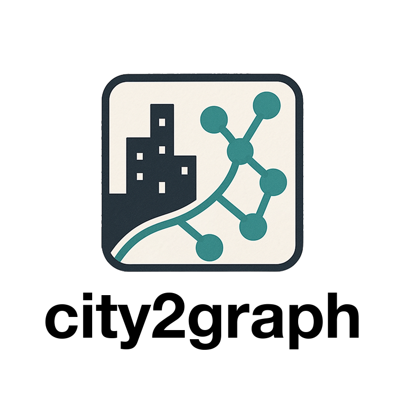

# Presentation slides

This is a page for the tech temo for Graph Representation Learning. Please check the pdf in the directory:)

## Google Colab Notebook

You can access the Google Colab notebook for this presentation here:
[GNN Technical Demonstration](https://colab.research.google.com/drive/1f6l3cIVc29mkhdtNykn5lPy_W3_7RssL?usp=sharing)

It covers node prediction on the Karate Club community and link prediction of Santandar Bikes in London.

## Misc.
I am developing a Python package [city2graph](https://ysato.blog/city2graph/) to standardise my research outcomes, for graph representation learning in cities. It would be helpful if you have any comments or suggestions for it!😄

